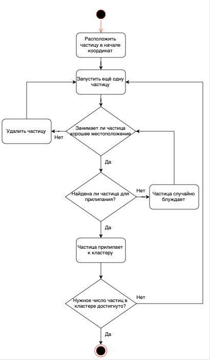
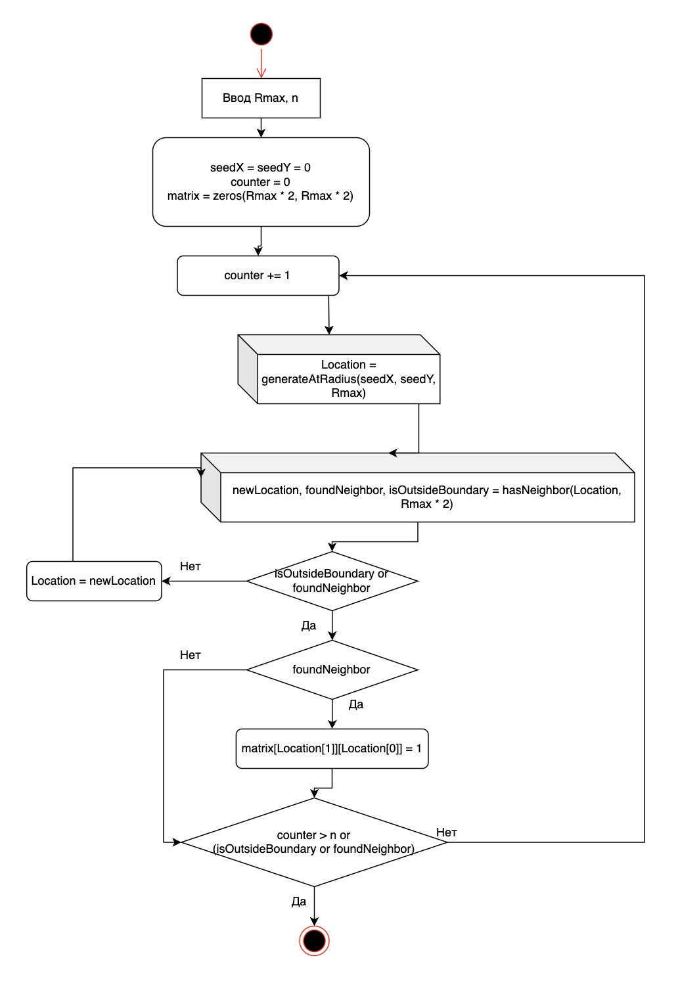
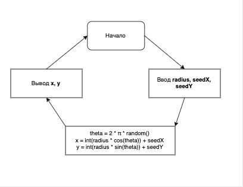
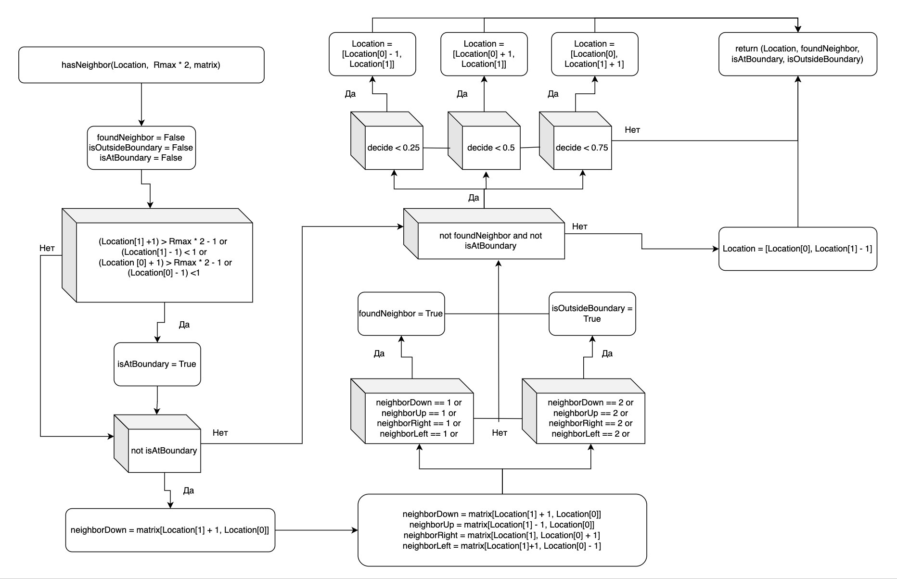

Защита второго этапа проекта:

<iframe width="720" height="405" src="https://rutube.ru/play/embed/d2df0de5ff6dd11545bcb309a66483d4" frameBorder="0" allow="clipboard-write; autoplay" webkitAllowFullScreen mozallowfullscreen allowFullScreen></iframe>

<!--more-->

<iframe width="720" height="405" src="https://plvideo.ru/watch?v=bYsc3mvq8Rki" frameBorder="0" allow="clipboard-write; autoplay" webkitAllowFullScreen mozallowfullscreen allowFullScreen></iframe>

# Введение

**Цель работы**

Целью данной работы является изучение процесса формирования фракталов с использованием модели агрегации, ограниченной диффузией (DLA), реализованной на сетке.

**Задачи**

- Рассмотреть алгоритм моделирования DLA  
- Реализовать модель DLA на двумерной решётке  

# Выполнение работы

## Алгоритм DLA

Рассмотрим дискретную реализацию модели диффузионно-ограниченной агрегации (Diffusion Limited Aggregation, DLA [@sander2000]) на квадратной решётке.

Разместим исходную (затравочную) частицу в центре сетки. Будем выпускать отдельные частицы с некоторого расстояния, превышающего предполагаемый максимальный радиус итогового агрегата. Каждая частица будет двигаться случайным образом, делая шаги в одном из четырёх направлений (вверх, вниз, влево или вправо) с равной вероятностью. Если частица оказывается рядом с уже занятым узлом, она присоединяется к агрегату. Затем запускаем следующую частицу и повторяем процесс. Один шаг по решётке соответствует диаметру частицы. Общая схема алгоритма представлена на рисунке (рис. @fig:001).

{#fig:001 width=100%}

## Реализация алгоритма DLA

Для реализации алгоритма создадим двумерный массив, в котором 1 будет означать наличие частицы в клетке, а 0 — её отсутствие. Разместим первую частицу в центре. Новые частицы будем запускать до тех пор, пока не достигнем заданного количества, либо пока агрегат не выйдет за пределы допустимого радиуса. Используем функцию `generateAtRadius` для генерации начального положения частицы на окружности. Для обработки её движения и проверки условий контакта с агрегатом воспользуемся функцией `hasNeighbor`. Если частица оказывается рядом с занятым узлом, фиксируем её положение и переходим к следующей. Остановка происходит либо по количественному лимиту, либо при достижении предельного радиуса (см. рис. @fig:002).

{#fig:002 width=100%}

## Алгоритм выпускания частицы

Для оптимизации симуляции будем запускать частицы с окружности радиусом немного большим текущего максимального радиуса структуры. Случайные координаты точки на окружности определим по формулам[@medvedev2010]:
$$
x = r \cdot \cos(\theta),
y = r \cdot \sin(\theta),
$$
где $\theta$ — случайный угол из отрезка $[0, 2\pi]$, вычисляемый как $2\pi \cdot random$. Блок-схема алгоритма приведена на рисунке (рис. @fig:003).

{#fig:003 width=70%}

## Случайное блуждание

Рассмотрим двумерную решётку $Z^2$ с начальной точкой $(0, 0)$. В каждый момент времени частица может совершить один шаг в одном из четырёх направлений: вверх $(0, 1)$, вниз $(0, -1)$, вправо $(1, 0)$ и влево $(-1, 0)$, обозначаемых как $v^u$, $v^d$, $v^r$, $v^l$ соответственно.

Будем моделировать случайное блуждание, при котором частица в каждый момент времени переходит в одну из соседних клеток с равной вероятностью:
$$
S_n = \sum_{i=1}^{n} v_i^*,
P(v_{i+1} = v_n^*) = \frac{1}{4}
$$
где $v_n^*$ — случайное направление шага, $n$ — общее число шагов.

## Алгоритм движения частицы

Реализуем функцию, проверяющую положение частицы. Если она находится у границы поля — установим флаг `isAtBoundary`. Далее проверим, находится ли она рядом с уже присоединёнными частицами (`foundNeighbor`) или вышла за допустимый радиус (`isOutsideBoundary`).

Если ни одно из условий не выполнено, продолжим блуждание, выбрав новое направление движения. Функция возвращает новые координаты частицы, а также логические флаги, указывающие на нахождение у границы, вблизи других частиц или за пределами радиуса. Алгоритм изображён на схеме (рис. @fig:004).

{#fig:004 width=100%}

# Выводы

В ходе выполнения второго этапа проекта мы подробно рассмотрели алгоритм DLA и предложили способы его реализации. Были разработаны блок-схемы, отражающие ключевые этапы работы алгоритма и моделирования фрактальных структур.