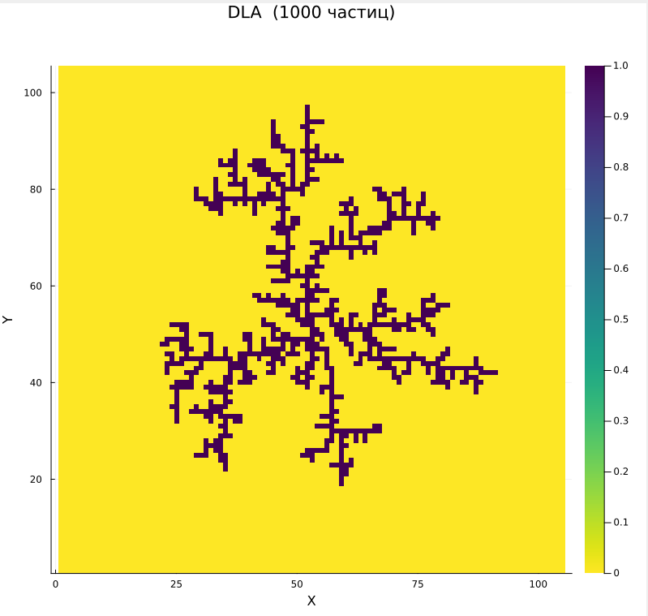
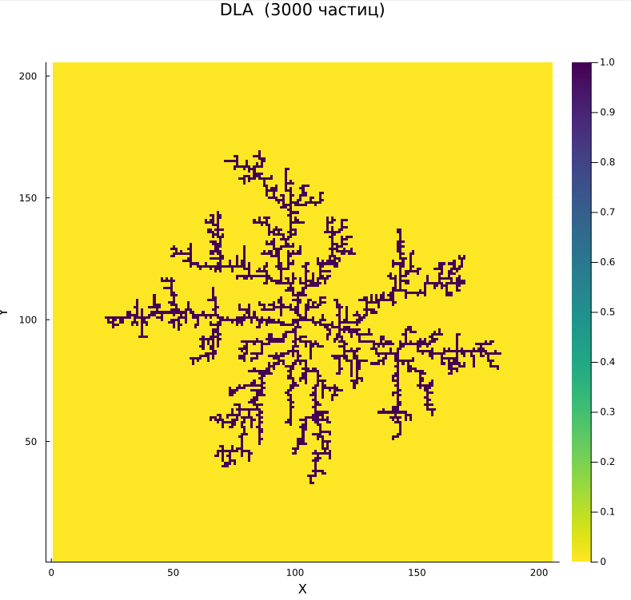
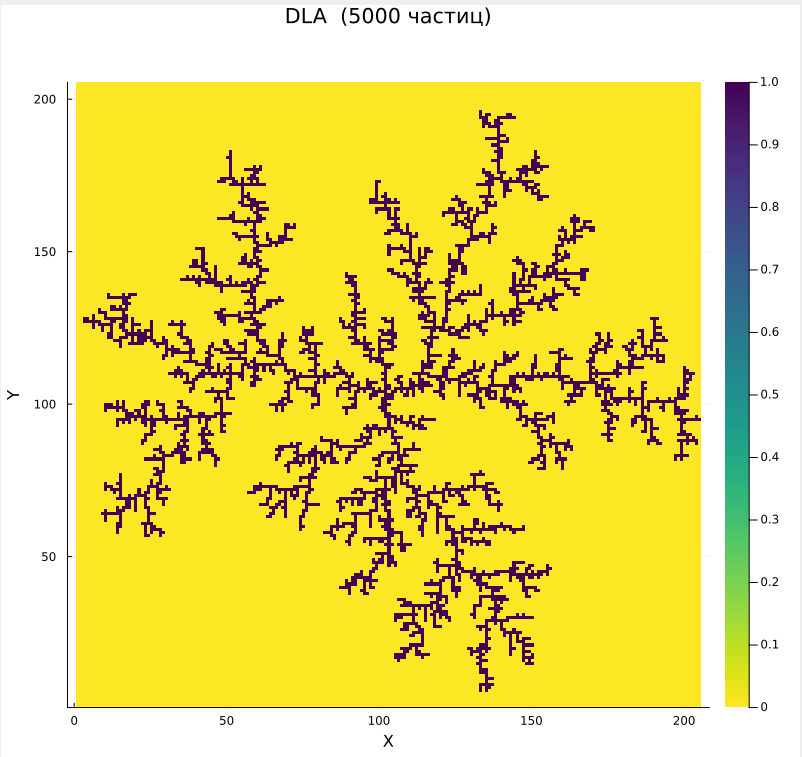

Защита третьего этапа проекта:

<iframe width="720" height="405" src="https://rutube.ru/play/embed/49560c06ba199e49a2e448932d7166fa/?p=jr9iP-YHlyou0KAXY6ugUg" frameBorder="0" allow="clipboard-write; autoplay" webkitAllowFullScreen mozallowfullscreen allowFullScreen></iframe>

<!--more-->

<iframe width="720" height="405" src="https://plvideo.ru/embed/fO9BfahNsPpi" title="Platform video player" allow="accelerometer; autoplay; clipboard-write; encrypted-media; gyroscope; picture-in-picture; web-share" referrerpolicy="strict-origin-when-cross-origin" allowfullscreen></iframe>

# Цель работы

**Цель:**

- Реализовать алгоритм моделирования агрегации, ограниченной диффузией (DLA), на языке программирования Julia.


**Задачи:**

- Изучить принципы неравновесной агрегации и условия образования фрактальных структур
- Проанализировать математическую модель DLA
- Реализовать DLA и визуализировать смоделированные кластеры

# Теоретическое введение

На данном этапе исследуется процесс Diffusion-Limited Aggregation (DLA) — модель роста кластеров, в которой частицы, совершающие случайные блуждания (диффузию), постепенно присоединяются к неподвижному зародышу или кластеру. В результате образуются фрактальные структуры с ветвящейся, самоподобной формой.

DLA применяется для моделирования:

 - Кристаллизации в пересыщенных растворах
 - Электролитического осаждения металлов
 - Роста бактериальных колоний
 - Формирования сосудистых сетей [@mandelbrot1982]

## Алгоритм DLA

1. Инициализация: в центре поля размещается "зародыш" кластера (одна частица).

2. Генерация частицы: новая частица появляется на окружности большого радиуса вокруг кластера.

3. Случайное блуждание: частица перемещается случайным образом (в одном из 8 направлений).

4. Агрегация: если частица касается кластера, она прилипает к нему.

5. Условия остановки:
- Частица уходит слишком далеко → удаляется.
- Достигнуто нужное количество частиц → симуляция завершается [@medvedev2010].

# Программная реализация на Julia

## Подключение библиотек

```julia
using Plots
using Random
using ColorSchemes
```


## Функция `randomAtRadius(radius, seedX, seedY)`

Генерирует начальное положение частицы на окружности заданного радиуса.

- Использует случайный угол $\theta \in [0; 2\pi]$.
- Переводит полярные координаты $(r, \theta)$ в декартовы $(x, y)$.
- Возвращает координаты в виде массива [x, y] [@julialan].

```julia
function randomAtRadius(radius, seedX, seedY)
    theta = 2*pi * rand()
    x = round(Int, radius * cos(theta)) + seedX
    y = round(Int, radius * sin(theta)) + seedY
    return [x, y]
end

```

## Функция `performRandomWalk(location, squareSize)`

Совершает один шаг случайного блуждания частицы.

- Случайно выбирает смещение по x и y: -1, 0 или 1.
- `clamp` ограничивает координаты, чтобы частица не вышла за границы поля.

```julia
function performRandomWalk(location, squareSize)
    x, y = location
    step = rand((-1, 0, 1), 2)
    new_x = clamp(x + step[1], 1, squareSize)
    new_y = clamp(y + step[2], 1, squareSize)
    return [new_x, new_y]
end
```

**Пример вызова:**

```julia
new_location = performRandomWalk([50, 50], 100)
```

## Функция `growDLAcluster(radius, maxParticles)`

Основная функция, которая выращивает кластер.

**Шаги работы:**

1. Создает квадратную матрицу matrix (поле для кластера).
2. Помещает первую частицу в центр.
3. В цикле:
- Генерирует новую частицу на динамически увеличивающемся радиусе.
- Частица блуждает, пока не присоединится к кластеру или не выйдет за пределы.
- При присоединении значение в matrix меняется на 1.
4.  Возвращает заполненную матрицу.

```julia
function growDLAcluster(radius, maxParticles)
    squareSize = radius * 2 + 5
    matrix = zeros(Int, squareSize, squareSize)
    center = squareSize ÷ 2
    matrix[center, center] = 1
    randomWalkersCount = 0
    maxAttempts = 10_000
    cluster_radius = 1

    while randomWalkersCount < maxParticles
        location = randomAtRadius(cluster_radius + 5, center, center)
        attempts = 0

        while attempts < maxAttempts
            location = performRandomWalk(location, squareSize)
            x, y = location

            if (x > 1 && matrix[x-1, y] == 1) ||
               (x < squareSize && matrix[x+1, y] == 1) ||
               (y > 1 && matrix[x, y-1] == 1) || 
               (y < squareSize && matrix[x, y+1] == 1)
                matrix[x, y] = 1
                randomWalkersCount += 1
                cluster_radius = max(cluster_radius, sqrt((x-center)^2 + (y-center)^2))
                break
            end
            attempts += 1
        end
    end
    return matrix
end
```

**Пример вызова:**

```julia
matrix = growDLAcluster_optimized(50, 1000)
```

## Визуализация 

Используется пакет Plots для отрисовки фракталоподобного кластера с ветвящейся структурой [@julia2023].

```julia
heatmap(matrix, 
    title="DLA ($maxParticles частиц)", 
    xlabel="X", 
    ylabel="Y",
    seriescolor=cgrad(ColorSchemes.viridis, rev=true),
    aspect_ratio=:equal,
    size=(800, 800),
    dpi=300
)
```

# Результаты

Приведенная выше программная реализация позволяет моделировать DLA-процесс с настраиваемыми параметрами. Полученные кластеры демонстрируют фрактальные свойства, характерные для неравновесных процессов.

**Инициализация параметров:**

```julia
radius = 50
maxParticles = 1000

```

**Моделирование:**

```julia
matrix = growDLAcluster(radius, maxParticles)
```

**Визуализация:**

```julia
heatmap(matrix, 
    title="DLA  ($maxParticles частиц)", 
    xlabel="X", 
    ylabel="Y",
    seriescolor=cgrad(ColorSchemes.viridis, rev=true),
    aspect_ratio=:equal,
    size=(800, 800),
    dpi=300
)
```


На рис. [-@fig:1] можно наблюдать визуализацию кластера из 1000 частиц с радиусом 50:

{#fig:1 width=70%}

На рис. [-@fig:2] можно наблюдать визуализацию кластера из 3000 частиц с радиусом 100:

{#fig:2 width=70%}

На рис. [-@fig:3] можно наблюдать визуализацию кластера из 5000 частиц с радиусом 100:

{#fig:3 width=70%}

# Выводы

Был реализован алгоритм моделирования агрегации, ограниченной диффузией, на языке программирования Julia.
