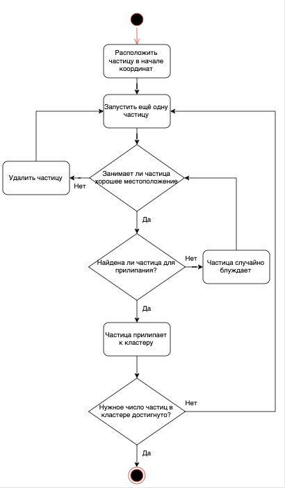
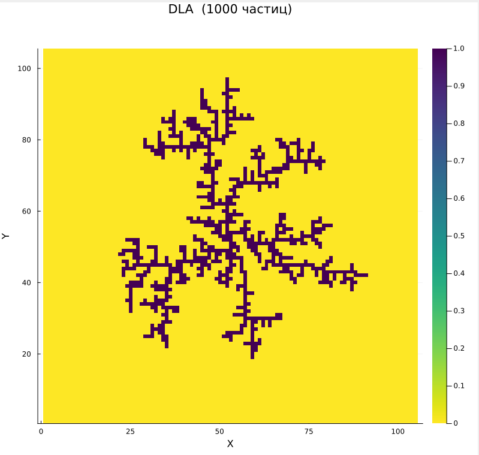
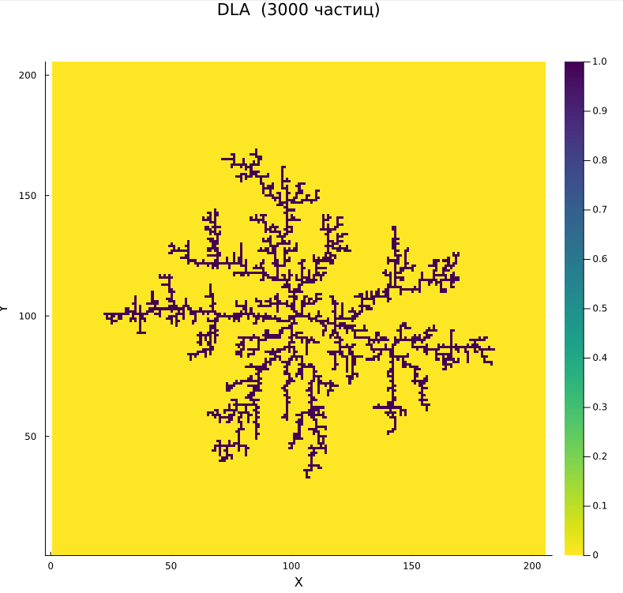

Защита четвертого этапа проекта:

<iframe width="720" height="405" src="https://rutube.ru/play/embed/49560c06ba199e49a2e448932d7166fa/?p=jr9iP-YHlyou0KAXY6ugUg" frameBorder="0" allow="clipboard-write; autoplay" webkitAllowFullScreen mozallowfullscreen allowFullScreen></iframe>

<!--more-->

<iframe width="720" height="405" src="https://plvideo.ru/embed/fO9BfahNsPpi" title="Platform video player" allow="accelerometer; autoplay; clipboard-write; encrypted-media; gyroscope; picture-in-picture; web-share" referrerpolicy="strict-origin-when-cross-origin" allowfullscreen></iframe>

# Введение

**Актуальность**

Существуют разнообразные физические процессы, основная черта которых – неравновесная агрегация. Примеры: образование частиц сажи, рост осадков при электрическом осаждении и распространение воды в нефти. Один из важных примеров фракталов появляется при добыче нефти. Нефтяники через одну из скважин заливают в месторождение нефти воду. Из других скважин начинает выходить нефть. Однако вода распространяется внутри месторождения неравномерно, образуя т.н. "фьорды". Нефть, находящаяся в этих фьордах не выходит наружу и остается не добытой. Поэтому вместо воды необходимо найти жидкость, для которой эти фьорды будут минимальны.

Во всех случаях происходит необратимое прилипание частиц к растущему кластеру из-за сильного смещения равновесия в сторону твердой фазы, и вырастают разветвленные агрегаты (рост правильных ограненных кристаллов происходит в условиях, близких к равновесным, когда возможно как прилипание частиц, так и их обратный переход в раствор)[@medvedev2010].

**Цель работы**

Исследовать модель агрегации, ограниченной диффузией(DLA).

**Объект и предмет исследования**

- Модель DLA

**Задачи**

- Реализовать численное моделирование процесса диффузионно-ограниченной агрегации
- Построить модель агрегации, ограниченной диффузией

**Материалы и методы**

- Язык программирования Julia
  - Plots.jl
  - Random.jl
  - ColorSchemes.jl

# Теоретическое описание задачи

## Фрактальная размерность

$$
d = \lim_{\epsilon \rightarrow 0}(\dfrac{ln(N(\epsilon))}{ln(\dfrac{1}{\epsilon})})
$$

Это равенство является определением размерности, которая обозначается $d$. Для построения зависимости между оценкой радиуса и массы кластера (линейна) на логарифмической диаграмме, функция имеет вид:

$$
ln(N(\epsilon)) = D ln(R) + b,
$$

где $D$ – фрактальная размерность, $N(\epsilon)$ – число частиц на расстоянии меньшем чем $R$, $R$ – радиус 

## Агрегация, ограниченная диффузией

Агрегация, ограниченная диффузией (diffusion-limited aggregation, DLA) --- первая модель агрегации, разработанная Виттеном и Сандером в 1981 году. Она представляет шумный рост, ограниченный диффузией. Этот процесс довольно распространен в природе, и простой алгоритм дает хорошее представление о крупномасштабной структуре многих природных объектов[@sander2000].

У получающегося кластера может быть много различных форм, преимущественно зависящих от трёх факторов:

- положение центра агрегации;
- начальное положение движущейся частицы;
- алгоритм моделирования движения.

По алгоритму движения частицы существует два подхода к базовому моделированию DLA. Один работает с фиксированной сеткой, а другой — без сетки и использует частицы. Сетки обеспечивают жесткую структуру, которая упрощает модель. В этом случае частица может двигаться по сетке только к одному из четырех соседей.

# Программная реализация

## Описание алгоритма 

Рассматрим сеточную модель агрегации, ограниченной диффузией (Diffusion Limited Aggregation, DLA [@sander2000]). 

Возьмем регулярную квадратную сетку на плоскости.
В центр поместим затравочную частицу. Затем с расстояния чуть больше желаемого максимального радиуса итогового агрегата будем выпускать по одной новые частицы. Выпущенная частица совершает случайные блуждания по сетке, делая шаги в одном из четырех доступных направлений с равной вероятностью. Если частица оказывается по соседству с затравкой, она прилипает и остается в этом узле. Затем выпускаем следующую частицу, которая может прилипнуть к одному из занятых узлов. Шаг решетки в этой модели соответствует диаметру частицы(мы рассматриваем единичный шаг)(рис. [-@fig:001]).

{#fig:001 width=100%}

Для ускорения работы программы разумно выпускать частицы с круга радиусом немного больше Rmax текущего максимального радиуса агрегата. Функция генерирует случайное расположение точки на заданном радиусе по формуле[@medvedev2010]:

$$
x = r * cos(\theta)
y = r * sin(\theta),
$$

где $\theta$ – случайный угол от $0$ до $2 \pi$, заданный формулой: $2\pi random$

## Случайное блуждание

Рассмотрим целочисленную решётку $Z^2$ на плоскости с отмеченной точкой $(0, 0) ∈ Z^2$ – началом координат. Каждой точке решётки  соответствуют четыре точки, в которые можно из неё шагнуть по выходящим из неё  ребрам: мы будем обозначать эти точки  $v^u = (0,1)$ , $v^d = (0,-1)$, $v^r = (1,0)$, $v^l = (-1,0)$ для шагов направо, налево, вверх и вниз соответственно. 
Случайное блуждание – это недетерминированное передвижение по решетке Z^2: стартуя из нуля, мы делаем один шаг в секунду, переходя в одну из соседних вершин к той вершине, в которой мы находились в предыдуший момент. При этом решение, в какую вершину шагнуть, принимается случайным образом.

Обозначим $v^u = (0,1)$ , $v^d = (0,-1)$, $v^r = (1,0)$, $v^l = (-1,0)$ - шаг на 1 вверх, вниз, влево, вправо соответственно.

$\{S_n\}$ - ряд, описывающий случайное блуждание, $* = u, d, r, l$, $n$ - количество шагов

$$
S_n = \sum^n_{i=1}{v_n^*}, 
$$

$$
P(v_{i+1} = v_n^*) = \dfrac{1}{4}
$$

# Результаты

## DLA кластер

Программная реализация, приведенная в третьем этапе, позволяет моделировать DLA-процесс с настраиваемыми параметрами. Полученные кластеры демонстрируют фрактальные свойства, характерные для неравновесных процессов.

На рис. [-@fig:002] можно наблюдать визуализацию кластера из 1000 частиц с радиусом 50:

{#fig:002 width=100%}

На рис. [-@fig:003] можно наблюдать визуализацию кластера из 3000 частиц с радиусом 100:

{#fig:003 width=100%}

На рис. [-@fig:004] можно наблюдать визуализацию кластера из 5000 частиц с радиусом 100:

{#fig:004 width=100%}

# Выводы

- Реализовано численное моделирование процесса диффузионно-ограниченной агрегации
- Построена модель агрегации, ограниченной диффузией