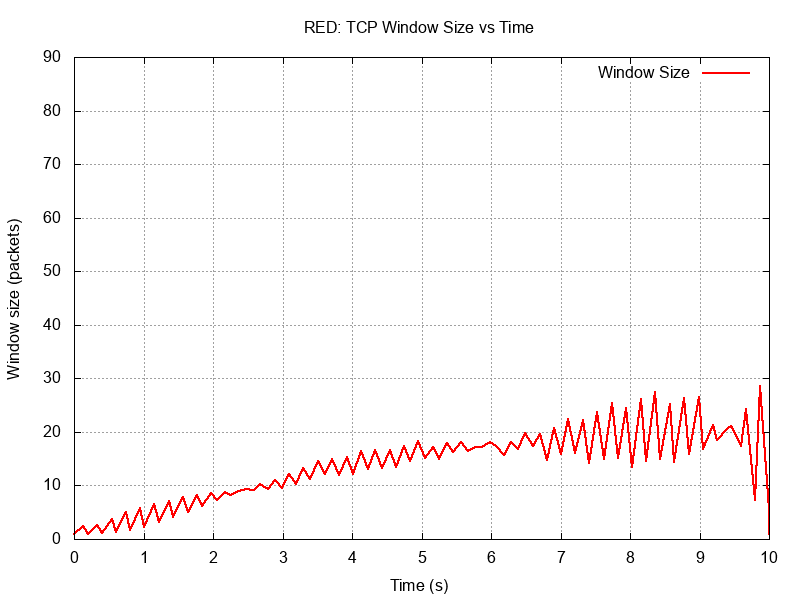
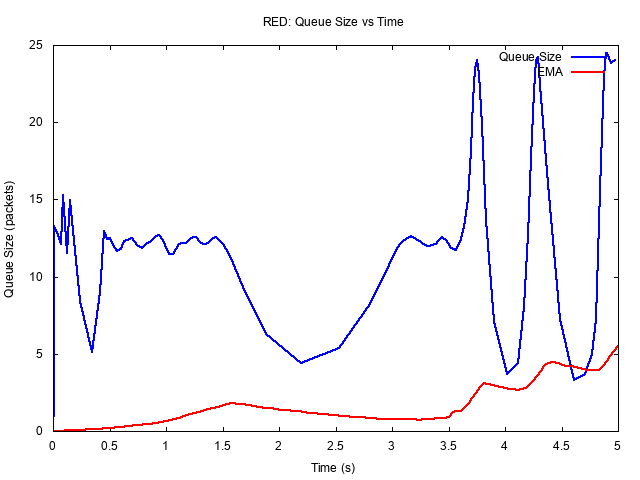
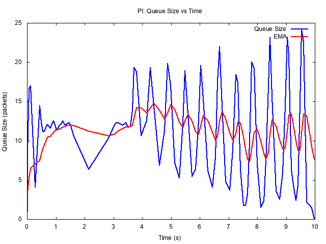
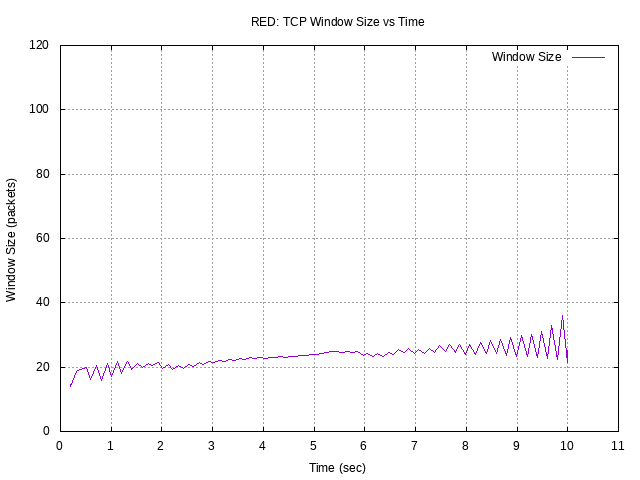
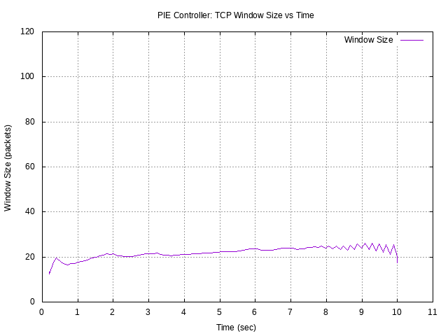
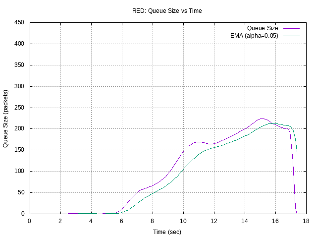
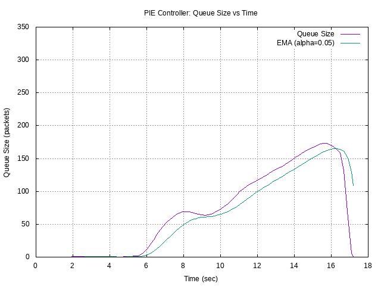

## Введение

Статья написана с целью приобретения опыта работы со средствами натурного и имитационного моделирования для последующего написания курсовой работы. Для реализации мультимодельного подхода к построению сети были выбраны средства NS2 и Mininet. Они выбраны из-за простоты использования, что позволяет изучить основные возможности инструментов за короткое время. В процессе подготовки к работе, мы нашли информацию о встроенных инструментах визуализации мониторинга сетей, например, NAM и xgraph для NS2 и Mininet-Wireshark и Mininet-CLI.

NS-2 (Network Simulator 2) и Mininet — это инструменты для моделирования и анализа сетевых систем. NS-2 — это дискретный событийный симулятор, написанный на C++ и OTcl. Он используется для имитации сетевых протоколов, таких как TCP, UDP, и маршрутизации. NS-2 поддерживает детальное моделирование сетевого трафика, задержек и потерь пакетов. Он требует написания сценариев на OTcl. Такие скрипты не нуждаются в перекомпиляции, однако это делает NS2 несовместимым с более поздней версией — NS3. Mininet — это легковесный инструмент для создания виртуальных сетей на основе Linux. Он использует пространства имен и виртуальные интерфейсы для эмуляции хостов, коммутаторов и контроллеров SDN. Он прост в использовании, поддерживает Python для создания топологий и позволяет быстро развертывать и тестировать сети.

В современных сетевых технологиях управление очередями играет важную роль в обеспечении качества обслуживания (QoS). Алгоритмы RED и PI Controller используются для управления перегрузками в сетях, но их поведение и эффективность могут значительно различаться. В данной работе проводится сравнение этих алгоритмов в сетевых симуляторах NS2 и Mininet.

## Основная часть}

### NS2

Создается сеть, состоящая из 202 узлов. Размещается 100 TCP источников и 100 приемников. Основное внимание уделяется соединению между двумя ключевыми узлами — n(0) и n(1). Эти узлы соединены дуплексным каналом с пропускной способностью 100 Мбит/с и задержкой 10 мс. Данные параметры позволяют создать модель сети FastEthernet. В качестве алгоритма управления очередью на этом канале используется PI-контроллер (Proportional-Integral controller). Основная задача PI-контроллера — минимизировать ошибку между желаемым (целевым) значением и текущим состоянием системы. Рассмотрим более детально управление очередью с помощью PI-контроллера.

1. Параметр target\_q\_ характеризует целевой размер очереди, который PI-контроллер стремится поддерживать. В данном случае контроллер будет стараться удерживать очередь на уровне 15 пакетов. Этот параметр определяет, насколько "заполненной" должна быть очередь. Если очередь становится больше, чем 15 пакетов, контроллер начнет принимать меры для уменьшения её размера (например, увеличивая интенсивность сброса пакетов). Если очередь меньше, контроллер будет стараться уменьшить интенсивность сброса, чтобы избежать простоя.
2.  Параметр a\_ - это коэффициент пропорциональной составляющей в PI-контроллере. Он определяет, насколько сильно контроллер реагирует на текущую ошибку (разницу между текущим размером очереди и целевым значением). Чем больше значение , тем быстрее контроллер будет реагировать на отклонения от целевого размера очереди. Значение 0.0005 указывает на относительно умеренную реакцию на ошибку.    
3.  Параметр b\_ - это коэффициент интегральной составляющей в PI-контроллере. Он определяет, насколько сильно контроллер учитывает накопленную ошибку за всё время работы.  Значение 0.00001 указывает на то, что интегральная составляющая будет влиять на управление относительно слабо, что может быть полезно для предотвращения излишней агрессивности контроллера.  
4. Параметр interval\_ характеризует интервал времени (в секундах), через который PI-контроллер обновляет свои вычисления и корректирует управление очередью. Интервал 0.1 секунды означает, что контроллер будет пересчитывать управляющие воздействия 10 раз в секунду. 

От ключевых центральных узлов отходят остальные узлы. Эти соединения также имеют пропускную способность 100 Мбит/с и задержку 10 мс, но используют алгоритм DropTail для управления очередью. Данный алгоритм - это алгоритм пассивного управления очередью, устанолвенный в NS2 по умолчанию. Он предполагает добавление пакетов до достижения максимальной ёмкости и отбрасывание пакетов при переполнении очереди. 

Вся сеть визуализируется с помощью инструмента nam, а данные о размере очереди, среднем размере окна TCP и других параметрах записываются в файлы для последующего анализа и построения графиков c помощью gnuplot.

Также создается сеть из 202 узлов, но здесь используется другой алгоритм управления очередью — RED (Random Early Detection). RED работает на основе вероятностного сброса пакетов до того, как очередь переполнится. Основная идея заключается в том, чтобы заранее сигнализировать источникам трафика о возможной перегрузке, заставляя их снизить скорость передачи данных. Это достигается за счет мониторинга среднего размера очереди и сброса пакетов с определенной вероятностью, когда очередь начинает приближаться к максимальному размеру.

### Mininet

Сеть состоит из двух хостов (h1 и h2) и одного маршрутизатора (router), соединенных между собой. Хосты находятся в разных подсетях, а маршрутизатор выполняет роль шлюза для передачи данных между ними. Настроена пропускная способность 100 Мбит/с и задержка 10 мс, что соответствует сети Fast Ethernet. На интерфейсах маршрутизатора (router-eth1 и router-eth2) в первом случае для управления очередями настроен алгоритм RED (Random Early Detection), а во втором - PIE Controller (Proportional Integral Controller Enhanced).
Симуляция в обоих случаях длится по 10 секунд, в процессе создаются 50 сессий. 
Разберем подробнее синтаксис команд.

```
  tc qdisc add dev router-eth1 root red limit 25 min 3000 max 37500 avgpkt 1500 probability 1.0
```

```
  tc qdisc add dev router-eth1 root pie limit 25 target 20ms tupdate 30ms
```

1. Для использования RED и PIE Contoller необходимо воспользоваться утилитой **traffic control**. Она используется для настройки системы контроля трафика (Traffic Control) ядра Linux. Система контроля трафика состоит из:
    - ОГРАНИЧЕНИЕ ИСХОДЯЩЕГО ТРАФИКА (SHAPING)
    Когда трафик сформирован, его полоса пропускания начинает контролироваться. Ограничение может дать больше, чем уменьшение полосы пропускания - оно также используется для сглаживания пиков для более прогнозируемого поведения сети.
    - ПЛАНИРОВАНИЕ (SCHEDULING)
    Планирование передачи пакетов позволяет увеличить интерактивность исходящего трафика при гарантировании полосы пропускания для передачи данных большого объема. Такое упорядочение также называется приоритезацией и применяется для исходящего трафика.
    - ОГРАНИЧЕНИЕ ВХОДЯЩЕГО ТРАФИКА (POLICING)
    механизм, с помощью которого можно ограничить количество пакетов или байт в потоке входящего трафика, соответствующих определенной классификации.
    - ОТБРАСЫВАНИЕ (DROPPING)
    Трафик, превышающий установленную полосу пропускания, может быть отброшен как для входящего, так и исходящего трафика.
   
  2. **qdisc** - сокращение от 'queueing discipline' (дисциплина очередности) является базовым для понимания контроля трафика. Когда ядру требуется отправить пакет на интерфейс, этот пакет ставится в очередь к qdisc, настроенный для этого интерфейса. Сразу же после этого ядро пытается получить сколько можно пакетов из qdisc для передачи их драйверу сетевого адаптера.
  3. **dev router-eth1** - указывает сетевой интерфейс, к которому применялась очередь.
  4. **root** - указывает, что это корневая очередь (верхний уровень иерархии очередей).
  5. **red/pi** - указывает, что используется алгоритм RED/PIE Controller.
  6. **min** - средний размер очереди, по достижении которого возникает вероятность отметки пакета.
  7. **max** - по достижении этого среднего размера очереди, вероятность пометки пакета максимальная. Значение должно быть как минимум вдвое больше, чем min, чтобы предотвратить синхронные повторные пересылки.
  8. **avgpkt 1500** - средний размер пакета в байтах.
  9. **probability 1.0** - максимальная вероятность отбрасывания пакетов.
  10. **target** — это желаемая задержка пакетов в очереди, которую PIE стремится поддерживать.
  11. **tupdate** — это интервал времени, через который PIE пересчитывает свои параметры (например, вероятность отбрасывания пакетов).

## Результаты

### NS2

Рассмотрим графики окна для сетей.

1.  График для RED:
  Размер TCP-окна постепенно увеличивается, но наблюдаются значительные колебания.
  Особенно заметны резкие скачки в конце симуляции (около 9-10 секунд), что может быть связано с вероятностным отбрасыванием пакетов при достижении пороговых значений очереди.
2.  График для PI-контроллера:
  Размер окна также увеличивается и наблюдаются колебания. Также как и в случае с RED, заметны резкие скачки в конце симуляции.
  Таким образом, при описанной нагрузке сети обработчики очередей показывают похожие результаты, хотя и используют разные подходы - вероятностный и детерминированный.




Рассмотрим графики с очередями пакетов.





1.  График для PI-контроллера:
    - Очередь начинает заполняться с первой секунды.
    - На второй секунде наблюдается резкий скачок вниз.
    - Максимальный размер очереди ограничен 25 пакетами. 
    - Экспоненциальная скользящая средняя стремится к целевому размеру очереди - 15 пакетов.
    - EMA сглаживает колебания и в целом следует за основным трендом очереди.
    - В конце симуляции размер очереди достигает нуля происходит резкое снижение размера очереди.
2.  График для RED:
    - Заполнение очереди также начинается на первой секунде и в течение этой секунд наблюдается значительный скачок вниз.
    - Максимальный размер очереди также ограничен 25ью пакетами.
    - График очереди более плавный и с меньшим количеством колебаний чем у PI-контроллера.
    - В конце симуляции размер очереди не достигает нуля.
    
PI-контроллер оказывается более агрессивным в управлении очередью, ограничивая её размер и быстрее реагируя на изменения трафика. Это делает его более эффективным в снижении задержек.

### Mininet

Для начала поработаем с RED: запустим симуляцию, построим два графика - график зависимости TCP-окна от времени и график длины очереди с экспоненциальной скользящей средней длины этой очереди. Рассмотрим графики TCP-окна:





1. График для RED:
  Размер TCP-окна постепенно увеличивается, но с течением времени наблюдаются значительные колебания.
  Особенно заметны резкие скачки в конце симуляции (около 9-10 секунд), что может быть связано с вероятностным отбрасыванием пакетов при достижении пороговых значений очереди.
2. График для PIE Controller:
	Размер окна также увеличивается, но изменения происходят более плавно.
	Колебания минимальны, и в конце теста окно остается более стабильным, чем в случае RED.

RED демонстрирует нестабильное поведение, особенно при высокой нагрузке. Это связано с вероятностным отбрасыванием пакетов, из-за чего окно TCP резко падает, а затем снова увеличивается. PIE обеспечивает более плавное управление трафиком за счет динамической регулировки вероятности отбрасывания пакетов, что приводит к меньшим колебаниям размера окна.
 
Рассмотрим графики с очередями пакетов:





1. График для PIE Controller:
    - Очередь начинает заполняться примерно на 6-й секунде.  
    - До 8-й секунды наблюдается резкий рост очереди, затем рост становится более плавным.  
    - Максимальный размер очереди достигает примерно 150 пакетов.  
    - EMA сглаживает колебания и в целом следует за основным трендом очереди.  
    - В конце (~16-17 сек) происходит резкое снижение размера очереди.  
2. График для RED:
    - Заполнение очереди также начинается на 6-й секунде, но её рост более плавный по сравнению с PIE.  
    - Максимальный размер очереди достигает около 250 пакетов, что заметно больше, чем у PIE.  
    - EMA также следует за основной очередью, сглаживая её колебания.  
    - В конце наблюдается аналогичное резкое падение очереди (~16-17 сек).

PIE оказывается более агрессивным в управлении очередью, ограничивая её размер и быстрее реагируя на изменения трафика. Это делает его более эффективным в снижении задержек. RED, в свою очередь, допускает рост очереди до больших значений, что может приводить к увеличению задержек в сети.

## Обсуждение

В ходе исследования был проведен сравнительный анализ двух инструментов моделирования сетей: NS2 (имитационное моделирование) и Mininet (натурное моделирование). Основное внимание уделялось оценке характеристик сетевого трафика при использовании алгоритмов управления очередями RED и PI Controller.

Результаты моделирования показали, что NS2 позволяет детально анализировать влияние алгоритмов управления очередями, однако требует использования сценариев на OTcl, что усложняет настройку и обработку результатов. В то же время Mininet обеспечивает приближенное к реальному моделирование, используя стандартные сетевые стековые протоколы Linux, но его точность ограничена виртуализацией.

По результатам исследования, PI Controller поддерживает стабильность размера очереди, эффективно регулируя перегрузку. Однако его параметры требуют тонкой настройки. RED, напротив, снижает вероятность перегрузки, предотвращая резкие изменения нагрузки, но его эффективность зависит от правильного выбора параметров. Отметим, что исследование проводилось в контролируемых условиях, без учета фонового трафика и реальных сетевых нагрузок. В будущем возможно применение средств натурного и имитационного моделирования для анализа более сложных топологий и адаптации методики для сетей с программно-конфигурируемой архитектурой (SDN).

## Заключение

В ходе исследования были проведены симуляции с использованием инструментов NS2 и Mininet для анализа поведения сетевого трафика и управления очередями. Основное внимание уделялось сравнению алгоритмов RED и PI Controller. Результаты показали, что PI Controller обеспечивает более стабильное управление очередью, что приводит к меньшим потерям пакетов и равномерной отправке данных. В то же время RED демонстрирует резкие колебания, что может негативно сказаться на производительности сети.

Оба инструмента, NS2 и Mininet, оказались эффективными для моделирования сетевого трафика, но имеют свои особенности. NS2 подходит для глубокого анализа сетевых протоколов, а Mininet — для быстрого тестирования в условиях, близких к реальным. Выбор инструмента зависит от целей исследования: NS2 предпочтителен для детализированного моделирования, а Mininet — для экспериментов с минимальными накладными расходами.